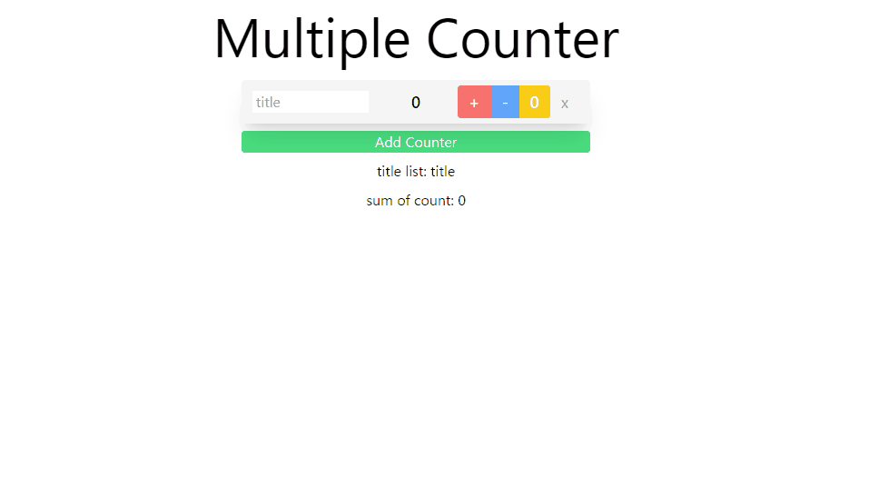

# Multiple Counter
複数のカウンターを作成し、合計値を算出することができるWebアプリです。

url: https://develop.d33n71zjml4ozu.amplifyapp.com/

# 要件
- カウントの増減やリセット機能
- カウンターの追加及び削除機能
- 各カウンターのタイトル設定機能
- 複数のカウンターの合計値表示機能

# 困難だった課題
Webアプリ作成後のAWS Amplifyへのデプロイで手間取った。
具体的には下記のエラーで時間を要した。
- svelteKitが自動的にインストールするアダプターがAmplifyは対応していなかった。
- Amplifyのnode.jsのバージョンがデフォルトだと、古いバージョンで使用しているバージョンに変えなければいけなかった。
- ビルド後のディレクトリ名の変更が必要だった。
- ビルド後のhtml名をindex.htmlにする必要があった。